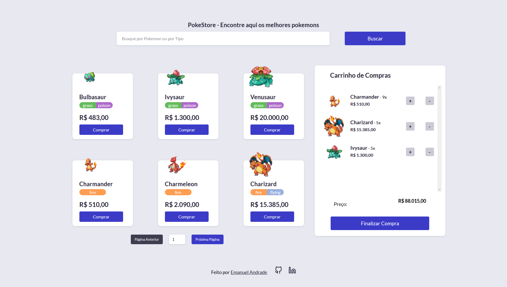

# Pokestore - Desafio Hiring Coders

Projeto desenvolvido para um desafio do programa de treinamento Hiring Coders. O desafio consistia na criação de uma loja com carrinho e que fosse integrada com a [PokeApi](https://pokeapi.co).

O sistema também poderia ser feito usando algum Framework JS, onde escolhi usar ReactJS com Typescript (por serem duas tecnologias ensinadas durante o treinamento).

Boa sorte encontrando os Pokemon Shiny, tem surpresinha.

### Funcionalidades Principais

 - [x] Catálogo de produtos

 - [x] Carrinho lateral

 - [x] Resumo do carrinho

### Funcionalidades Extras

 - [x] Barra de busca para filtrar os Pokémon

 - [x] Modal de obrigado ao finalizar compra

 - [x] Salvar os dados da compra do usuário localmente para não perdê-las ao atualizar a página

